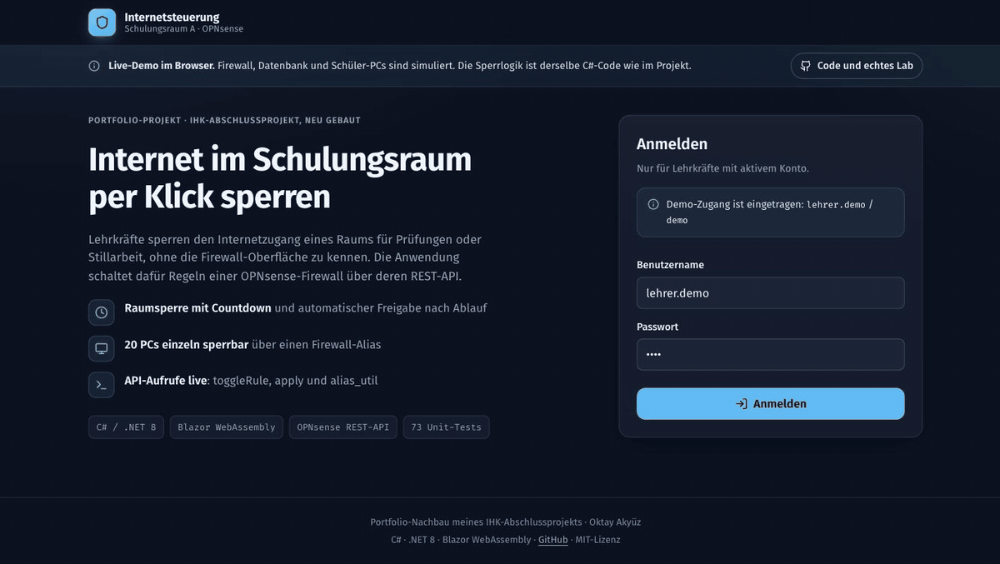

# Internetsteuerung Lab

**Lehrkräfte sperren und öffnen den Internetzugang eines Schulungsraums per Klick, über die REST-API einer OPNsense-Firewall.**

Portfolio-Nachbau meines IHK-Abschlussprojekts (Fachinformatiker Anwendungsentwicklung, Projekt bewertet mit „gut“). Neu geschrieben in C# und .NET 8, erweitert um die Punkte aus dem Ausblick meiner Projektdokumentation, und lauffähig in einem virtuellen Klassenraum-Netz, in dem die Sperre wirklich greift.

[](https://github.com/Oktay-94/internetsteuerung-lab/actions/workflows/ci.yml)


**▶ Live-Demo: <https://oktay-94.github.io/internetsteuerung-lab/>** (läuft im Browser, Demo-Zugang ist eingetragen)



*Demo im Lab: Nach „Internet sperren“ verlieren beide Schüler-PCs ihre Verbindung, der Countdown läuft, das Protokoll hält jede Aktion fest.*

---

## Worum es geht

In einem Schulungsraum mit rund 20 PCs sollen Lehrkräfte das Internet für Prüfungen oder Stillarbeit selbst sperren können, ohne Zugriff auf die Firewall-Oberfläche. Die Anwendung schaltet dazu eine einzelne Block-Regel auf der OPNsense:

- **Sofort sperren oder freigeben** per Knopf, mit Ampel-Anzeige
- **Zeitgesteuerte Sperre** mit 15, 30, 45, 60, 90 Minuten oder frei wählbar, mit Live-Countdown
- **Automatische Freigabe** nach Ablauf
- **Anmeldung** nur für aktive Lehrerkonten

## Schnellstart

Voraussetzung: Docker mit Compose (getestet mit Colima auf macOS und auf GitHub Actions).

```bash
scripts/lab.sh up      # erzeugt Zufallsgeheimnisse, baut und startet das Lab
scripts/lab.sh smoke   # End-to-End-Test: Sperre, automatische Freigabe, Zugangsschutz
scripts/lab.sh down    # alles entfernen
```

Danach läuft die Anwendung unter <http://127.0.0.1:8080>. Die Zugangsdaten gibt `scripts/lab.sh up` aus. Sie werden bei jeder Installation zufällig erzeugt und stehen nur in `lab/.env`, die nicht im Repository liegt.

## Live-Demo

Die [Live-Demo](https://oktay-94.github.io/internetsteuerung-lab/) läuft komplett im Browser als Blazor-WebAssembly-App auf GitHub Pages. Die Sperrlogik ist derselbe `SperrService` wie in der Web-Anwendung. Simuliert sind nur Firewall, Datenbank und die 20 Schüler-PCs des Raums. Die Seite zeigt die OPNsense-API-Aufrufe (`toggleRule`, `apply`, `alias_util`) mit, und mit einer benutzerdefinierten Sperre von 1 Minute sieht man die automatische Freigabe. Der Zustand gilt nur für den eigenen Browser und beginnt bei jedem Neuladen neu.

**Einzelne PCs sperren:** Zusätzlich zur Raumsperre lässt sich jeder der 20 PCs einzeln sperren und freigeben. Auf der OPNsense geht das über einen Host-Alias (`einzelsperre_raum_a`), auf den eine Block-Regel verweist. `alias_util/add` und `alias_util/delete` wirken sofort im Paketfilter, ohne `apply`. Die Logik steckt als `PcSperrService` im Core und ist mit Unit-Tests abgedeckt. Die Oberfläche dafür gibt es bisher nur in der Demo. Web-Anwendung, WinForms-Client und Lab schalten weiterhin die Raumsperre wie im Original.

## Das Lab: ein virtueller Klassenraum

Das Container-Netz bildet die physische Testumgebung aus dem Projekt nach, mit denselben Adressen.

| Container | Rolle | Adresse |
|---|---|---|
| `firewall` | Router mit NAT und der Regel „Internet-Sperre Raum A“ (nftables), OPNsense-kompatible REST-API über HTTPS | `10.20.0.1` |
| `web` | Lehrer-Anwendung (ASP.NET Core) | `10.20.0.10` |
| `schueler-pc-1`, `-2` | prüfen alle 2 Sekunden `1.1.1.1:443` und melden den Zustand | `10.20.10.101`, `.102` |
| `mariadb` | Datenbank `internetsteuerung` | Backend-Netz |

Das LAN ist als `internal` angelegt. Jedes Paket ins Internet muss durch den Firewall-Container. Ist die Regel aktiv, sind die Schüler-PCs messbar offline. Details und Diagramme stehen in [docs/architektur.md](docs/architektur.md).

**Gegen die echte OPNsense** läuft der Client ebenfalls: [docs/opnsense-vm.md](docs/opnsense-vm.md) beschreibt eine OPNsense-VM in QEMU, gegen die derselbe Code die echte API schaltet.

## Vom IHK-Projekt zum Lab

Die Fachlichkeit ist gleich geblieben. Technisch habe ich umgesetzt, was ich im Ausblick der Projektdokumentation selbst als nächsten Schritt genannt hatte, und die dort dokumentierten Einschränkungen behoben.

| Thema | IHK-Projekt | Nachbau |
|---|---|---|
| Oberfläche | WinForms-Desktop | WinForms-Client **und** Web-Oberfläche, gemeinsame Logik im Core |
| Testumgebung | physische Firewall, Switch, zwei PCs | Container-Lab mit echter Sperre, dazu echte OPNsense als VM |
| Automatische Freigabe | nur solange die Anwendung läuft (Abweichung 1.5.3) | Hintergrunddienst und gespeicherte Sperre, auch nach Neustart |
| Zugangsdaten der Firewall | Tabelle `raum` | Konfiguration bzw. Umgebungsvariablen, nie im Code |
| HTTPS zur Firewall | Zertifikatsprüfung abgeschaltet | Fingerabdruck-Pinning des selbstsignierten Zertifikats |
| Passwörter | SHA-256 ohne Salt | PBKDF2 mit Salt, alte Hashes werden beim Login umgestellt |
| Regel schalten | `toggleRule` ohne Zielzustand | expliziter Zielzustand `toggleRule/{uuid}/{0\|1}` |
| Nachvollziehbarkeit | keine | Protokoll: wer hat wann gesperrt, freigegeben oder es versucht |
| Tests | manuell (curl, Ping) | 73 Unit-Tests, End-to-End-Test und Windows-Build in der CI, Live-Tests gegen echte OPNsense 26.7 |

## Technik

- **C# 12, .NET 8**, Nullable und Analyzer aktiv, Warnungen gelten als Fehler
- **ASP.NET Core Blazor** (Server), Cookie-Anmeldung, Health-Checks unter `/health`
- **WinForms** für den Desktop-Client wie im Original
- **MariaDB** über MySqlConnector, alle Abfragen parametrisiert
- **OPNsense REST-API**: `search_rule`, `toggleRule`, `apply`
- **Docker Compose** mit drei Netzen, **nftables** im Firewall-Container
- **QEMU** für die OPNsense-VM
- **xUnit** mit Fake-Uhr und Fake-Firewall, **GitHub Actions** für Linux, Windows und das Lab

## Projektstruktur

```
src/Internetsteuerung.Core            Domäne und Logik (SperrService, PcSperrService, AuthService, PasswortHasher)
src/Internetsteuerung.Infrastructure  MariaDB, OpnsenseClient, Zertifikats-Pinning
src/Internetsteuerung.Web             Blazor-Oberfläche, REST-API, Hintergrunddienst
src/Internetsteuerung.WinForms        Desktop-Client
src/OpnsenseSim                       OPNsense-kompatible API für das Lab
src/Internetsteuerung.Demo            Live-Demo (Blazor WebAssembly, Simulation im Browser)
tests/Internetsteuerung.Tests         Unit-Tests
lab/                                  Docker Compose, Firewall- und Client-Container, Schema
scripts/                              lab.sh, opnsense-vm.sh
docs/                                 Architektur, OPNsense-VM
```

## Sicherheit

- Keine Zugangsdaten im Repository. Das Lab erzeugt sie bei `up` zufällig.
- Die Lab-Anwendung lauscht nur auf `127.0.0.1`.
- Anmeldung mit HttpOnly- und SameSite-Strict-Cookie, Formulare mit Antiforgery-Token.
- Die REST-API verlangt zusätzlich einen eigenen Header, den ein fremder Browser-Kontext nicht setzen kann.
- Die Firewall-API vergleicht Zugangsdaten zeitkonstant und antwortet sonst mit 401 (Teil des End-to-End-Tests).

## Hinweis

Dies ist ein eigenständiger Nachbau für mein Portfolio. Er enthält keinen Code, keine Daten und keine Dokumentation aus dem ursprünglichen Kundenprojekt. Firmen und Personen des Originals sind bewusst nicht genannt.

## Lizenz

MIT, siehe [LICENSE](LICENSE).

---

**English summary:** Portfolio rebuild of my final exam project as an application developer (German IHK, graded “good”). Teachers block and unblock a classroom’s internet access through the OPNsense REST API. C# and .NET 8 with a Blazor web UI and a WinForms client, MariaDB, a Docker Compose lab in which the block is enforced with nftables, a real OPNsense VM in QEMU, 73 unit tests and an end-to-end test in GitHub Actions. Live demo (Blazor WebAssembly, simulated firewall): <https://oktay-94.github.io/internetsteuerung-lab/>

Oktay Akyüz · [LinkedIn](https://www.linkedin.com/in/oktay-akyuez) · [GitHub](https://github.com/Oktay-94)
