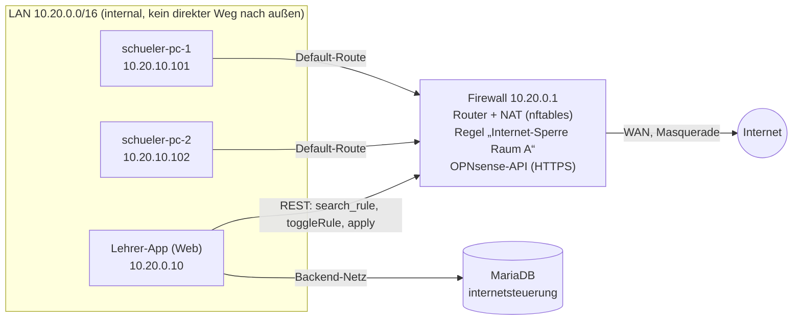
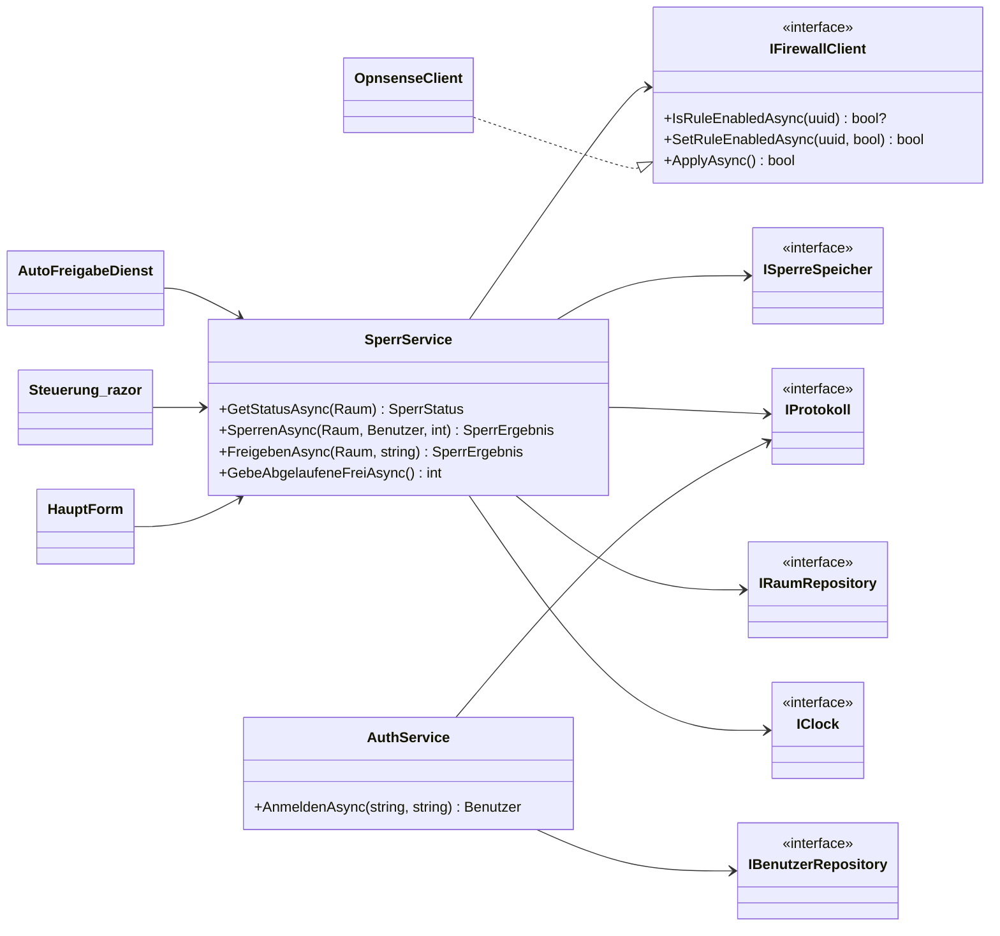
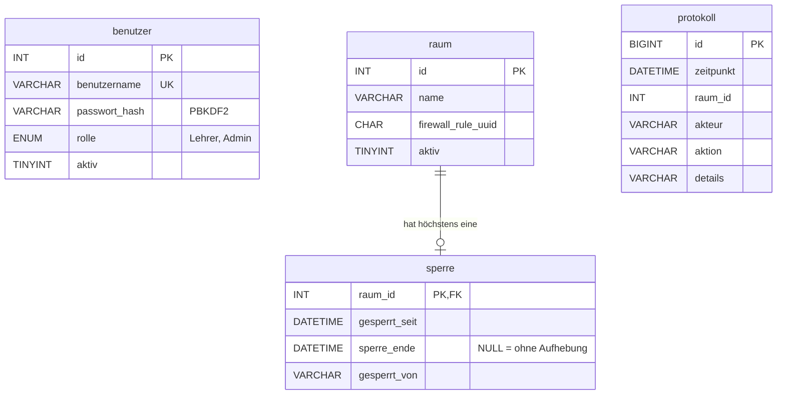
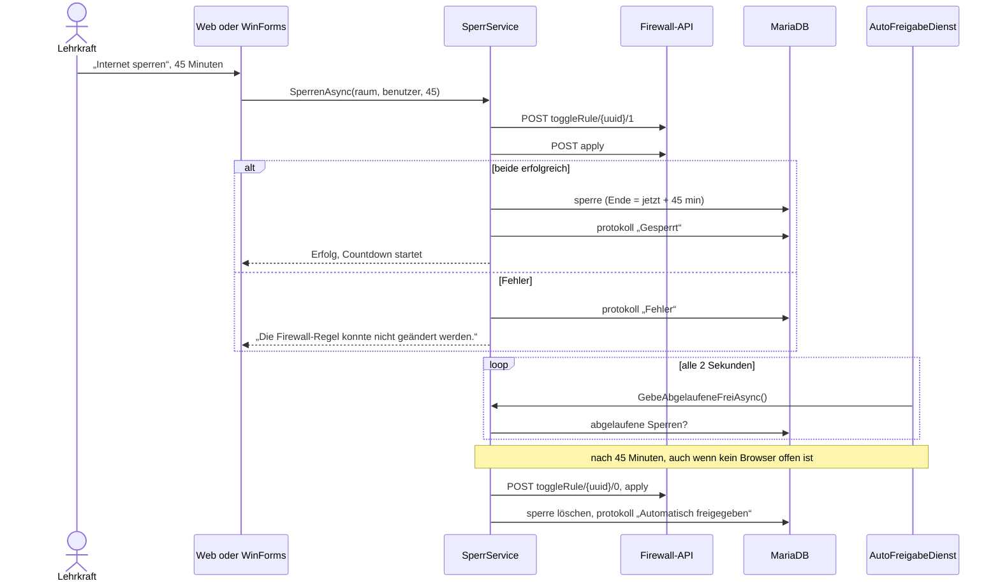

# Architektur

## Netz des Labs

Nachbildung der physischen Testumgebung aus dem IHK-Projekt als Container-Netz. Adressen wie im Original: Firewall `10.20.0.1/16`, Lehrer-PC statisch, Schüler-PCs aus dem früheren DHCP-Pool `10.20.10.100–200`.

Die Sperre ist echt: Ist die Regel aktiv, verwirft der Firewall-Container weitergeleitete Pakete aus `10.20.0.0/16`. Die Schüler-PCs melden alle zwei Sekunden, ob sie `1.1.1.1:443` erreichen.

## Schichten und Klassen

| Projekt | Aufgabe |
|---|---|
| `Internetsteuerung.Core` | Domäne und Logik ohne Abhängigkeit zu UI, Datenbank oder HTTP. Dadurch testbar mit Fake-Uhr und Fake-Firewall |
| `Internetsteuerung.Infrastructure` | MariaDB-Zugriff (asynchron, parametrisiert), `OpnsenseClient`, Zertifikats-Pinning, Registrierung im DI-Container |
| `Internetsteuerung.Web` | ASP.NET Core Blazor: Anmeldung, Steuerung, Protokoll, REST-API, Health-Checks, Hintergrunddienst |
| `Internetsteuerung.WinForms` | Desktop-Client wie im Original (Login-Dialog, Hauptfenster mit Ampel und Countdown) |
| `OpnsenseSim` | OPNsense-kompatible API im Lab, schaltet eine echte nftables-Regel |

Im Original lag die Logik direkt in `Form1`, und `Database` zeigte selbst `MessageBox`-Dialoge an (Doku 3.4.2). Jetzt kennt der Core keine Oberfläche. Web und Desktop teilen sich dieselbe Logik.

## Datenmodell

`benutzer` und `raum` entsprechen dem Original. API-Key, Secret und Basis-URL stehen nicht mehr in `raum`, sondern in der Konfiguration. `sperre` und `protokoll` sind neu.

## Ablauf einer zeitgesteuerten Sperre

