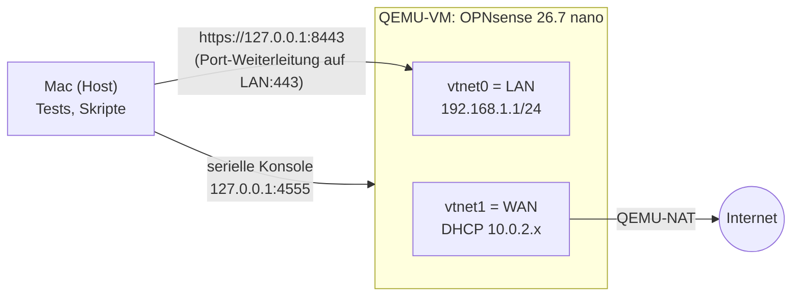

# Echte OPNsense als virtuelle Maschine

Das Container-Lab simuliert die OPNsense-API. Damit sicher ist, dass der Client auch gegen die echte Firewall funktioniert, läuft dieselbe Klasse `OpnsenseClient` gegen eine OPNsense-VM. Im Projektantrag des Originals war eine virtualisierte Testumgebung vorgesehen (Hyper-V mit mehreren VMs). Umgesetzt wurde damals eine physische Umgebung. Hier ist die virtualisierte Variante.

## Aufbau



- **Image:** offizielles `OPNsense-26.7-nano-amd64.img` von `pkg.opnsense.org`, SHA-256 gegen die offizielle Prüfsummendatei geprüft
- **Festplatte:** qcow2-Overlay auf dem unveränderten Image. Zurücksetzen heißt Overlay löschen
- **Netz:** zwei virtuelle Netzwerkkarten wie bei der physischen Appliance (LAN und WAN)
- **Erreichbarkeit:** Weboberfläche und API nur auf `127.0.0.1` des Hosts
- **Plattform:** Auf Apple Silicon wird x86_64 emuliert (QEMU TCG). Das ist langsamer als Hardware-Virtualisierung, genügt aber für API-Tests. Unter Linux mit KVM oder unter Windows mit Hyper-V läuft dasselbe Image mit voller Geschwindigkeit

## Ablauf

```bash
# 1. Image laden und prüfen (einmalig, ca. 490 MB)
mkdir -p ~/VMs/opnsense && cd ~/VMs/opnsense
curl -fLO https://pkg.opnsense.org/releases/26.7/OPNsense-26.7-nano-amd64.img.bz2
curl -fsL https://pkg.opnsense.org/releases/26.7/OPNsense-26.7-checksums-amd64.sha256 | grep nano
shasum -a 256 OPNsense-26.7-nano-amd64.img.bz2      # muss mit der Zeile oben übereinstimmen
bunzip2 -k OPNsense-26.7-nano-amd64.img.bz2

# 2. VM starten und warten, bis die Weboberfläche antwortet
scripts/opnsense-vm.sh start
scripts/opnsense-vm.sh status

# 3. Zertifikat pinnen: Fingerabdruck lesen und mit der Anzeige auf der OPNsense-Konsole vergleichen
echo | openssl s_client -connect 127.0.0.1:8443 2>/dev/null | openssl x509 -outform der \
  | openssl dgst -sha256 -r | cut -d' ' -f1 | tr a-f A-F > ~/VMs/opnsense/cert.sha256

# 4. API-Schlüssel über die serielle Konsole erzeugen (landet in ~/VMs/opnsense/api.env, Rechte 600)
#    Mit --erneuern wird der bisherige Schlüssel zuerst widerrufen (Rotation)
scripts/opnsense-apikey.py

# 5. Sperr-Regel „Internet-Sperre Raum A“ über die API anlegen und anwenden
scripts/opnsense-regel.py

# 6. Live-Test: derselbe Client schaltet die Regel auf der echten OPNsense
set -a; . ~/VMs/opnsense/api.env; set +a
OPNSENSE_URL=https://127.0.0.1:8443 OPNSENSE_CERT_SHA256=$(cat ~/VMs/opnsense/cert.sha256) \
  dotnet test tests/Internetsteuerung.Tests --filter OpnsenseLiveTests
```

Ohne gesetzte Variablen werden die Live-Tests übersprungen. Die normale Testsuite und die CI brauchen keine VM.

## Ergebnis (gemessen am 29.09.2026, OPNsense 26.7)

| Prüfung | Ergebnis |
|---|---|
| `search_rule` per GET mit `show_all=1&interface=lan`, wie im Original | HTTP 200, Regel per UUID gefunden |
| `toggleRule/{uuid}/1`, danach `apply` | `{"result":"Enabled","changed":true}`, `{"status":"OK"}` |
| Paketfilter nach dem Sperren (`pfctl -sr`) | 3 Regeln mit dem Label der UUID, z. B. `block drop in quick on vtnet0 inet from (vtnet0:network) to any` |
| `toggleRule/{uuid}/0`, danach `apply` | `Disabled`, im Paketfilter 0 Regeln |
| Live-Tests `OpnsenseLiveTests` mit dem unveränderten Produktiv-Client | 2 von 2 bestanden, inklusive Ablehnung eines falschen Zertifikats-Fingerabdrucks |

**Unterschied zur Simulation:** OPNsense 26.7 antwortet auf `apply` mit `"OK"` (groß, mit Zeilenumbrüchen), der Simulator und ältere Versionen mit `"ok"`. Der Client vergleicht deshalb ohne Beachtung der Groß- und Kleinschreibung und entfernt Leerraum. Ein Unit-Test sichert das ab.

## Warum der API-Schlüssel über die Konsole entsteht

OPNsense erzeugt API-Schlüssel sonst nur in der Weboberfläche. Das Skript nutzt dieselbe Funktion (`OPNsense\Auth\API::createKey`) über die serielle Konsole. So lässt sich die Einrichtung vollständig wiederholen, ohne Klicks und ohne die Warnung des Browsers zum selbstsignierten Zertifikat wegzuklicken. Key und Secret werden nie ausgegeben, sondern nur in eine Datei mit Rechten 600 geschrieben.
